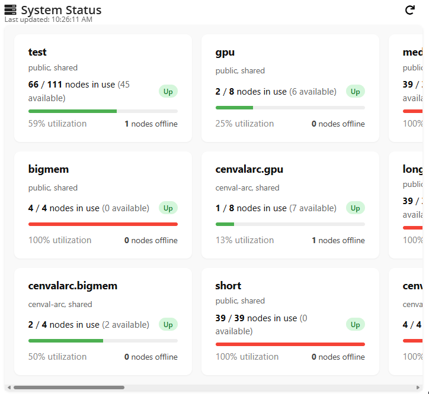

# OnDemand System Status Widget

**Reusable, transferable SLURM partition-level status widget for OnDemand dashboards.**  
Pulls raw `sinfo` output, summarizes per-partition usage, offline nodes, and shows utilization with visual bars and badges.

## About


This widget displays current system status by parsing the output of `sinfo` (SLURM) and rendering a compact, human-friendly overview of each partition: total vs used nodes, offline nodes, and percent utilization, with classification coloring. It is intended to be dropped into existing OnDemand-style dashboards with minimal changes so other sites/institutions can adopt the same status surface.

## Features

- Fetches live SLURM `sinfo` output embedded server-side.
- Aggregates per-partition totals, used, and offline node counts.
- Heuristic subtitle assignment based on partition naming conventions.
- Visual utilization bar with thresholds (green/yellow/red).
- Shows offline node count and relative usage.
- “Last updated” timestamp and manual refresh.
- Graceful fallback when `sinfo` output is missing or malformed.

## Installation

1. Copy `_sinfo.html.erb` into the appropriate widget directory of your dashboard codebase.  
2. Ensure the server-side template can execute `sinfo` and embed its output (e.g., via ERB as shown).  
3. Include the required CSS for `.sinfo-*`, `.status-chip`, `.offline`, `.red`/`.yellow`/`.green`, and utility classes so UI renders correctly.  
4. Provide FontAwesome (or substitute icons) for the header and refresh button.

## Usage

On page load, the script will:
- Parse the embedded raw `sinfo` output from the `<pre>` block.
- Aggregate node states per partition.
- Replace the raw text with styled status sections.
- Update the “Last updated” timestamp.
- Allow manual refresh via the refresh button.

## Configuration & Heuristics

### Data Source
The widget expects `sinfo` output in this format:
```erb
<pre>
  <%= `sinfo -o "%P %D %t %C %m %G %N" 2>/dev/null` %>
</pre>
```
Ensure the output includes column names such as `PARTITION`, `NODES`, and `STATE`. Adjust the format string if your SLURM environment differs.

### Subtitle Logic
Partition subtitles are inferred from naming patterns:
- `dept.*` → "department, condo"
- `pi.*` → "pi, condo"
- `grp.*` → "group, condo"
- Known public partitions like `short`, `medium`, `long`, `gpu`, `bigmem`, `test` → "public, shared"
- `cenvalarc.*` → "cenval-arc, shared"
- Default fallback → "standard, wide"

This logic lives in the `renderStatus` function and can be extended.

### Utilization Coloring
Percent used determines color:
- >= 90% → red
- >= 70% → yellow
- Otherwise → green

Corresponding classes (`.red`, `.yellow`, `.green`) must be defined in CSS.

## Error Handling

- If `sinfo` output is missing or malformed, shows:
  ```html
  <div class="no-data-msg">Unable to retrieve system status. SLURM may be unreachable.</div>
  ```
- Refresh reloads the page content with `cache: "no-store"` to attempt fresh data.

## Extensibility Ideas

- Link partition names to deeper dashboards.
- Make subtitle mappings and thresholds configurable via `data-` attributes or external config.
- Add sorting, collapsing, or alerting based on usage.
- Background polling instead of full reload for refresh.
- Localize timestamp formatting or add relative “X minutes ago”.

## Troubleshooting

- **Empty/invalid output**: Verify `sinfo` is runnable and that the ERB interpolation executes.  
- **Parsing issues**: Confirm header labels match expectations (`PARTITION`, `NODES`, `STATE`).  
- **Missing styles**: Ensure the CSS for the widget’s classes is loaded.  
- **Refresh no-op**: Check that caching isn’t preventing updated HTML and that the button wiring is intact.

## Contributing

1. Fork the repo.  
2. Improve heuristics, add configuration abstraction, or enhance accessibility.  
3. Submit a PR including:
   - Sample SLURM output used for testing.
   - Description of any new subtitle rules or thresholds.
   - Optional before/after screenshots.

## License

MIT License — see the `LICENSE` file for details.
